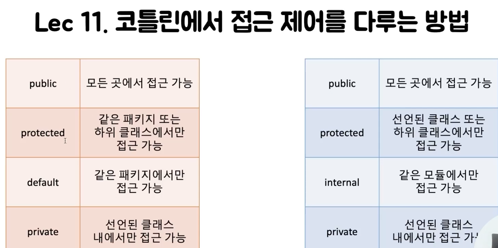

# Lec 11. 코틀린에서 접근 제어를 다루는 방법

- Kotlin 에서 패키지는 namespace 관리용이기 때문에 protected 의미가 달라졌다.

- Kotlin 에서는 default 가 사라지고, 모듈간의 접근을 통제하는 internal 이 새로 생겼다

- 생성자에 접근 지시어를 붙일 때는 constructor 를 명시적으로 써주어야 한다.

- 유틸성 함수를 만들 때 파일 최상단을 이용하면 편리하다.

- 프로퍼티의 custom setter 에 접근 지시어를 붙일 수 있다.

- 자바에서 코틀린 코드를 사용할 때 internal 과 protected 는 주의해야 한다.